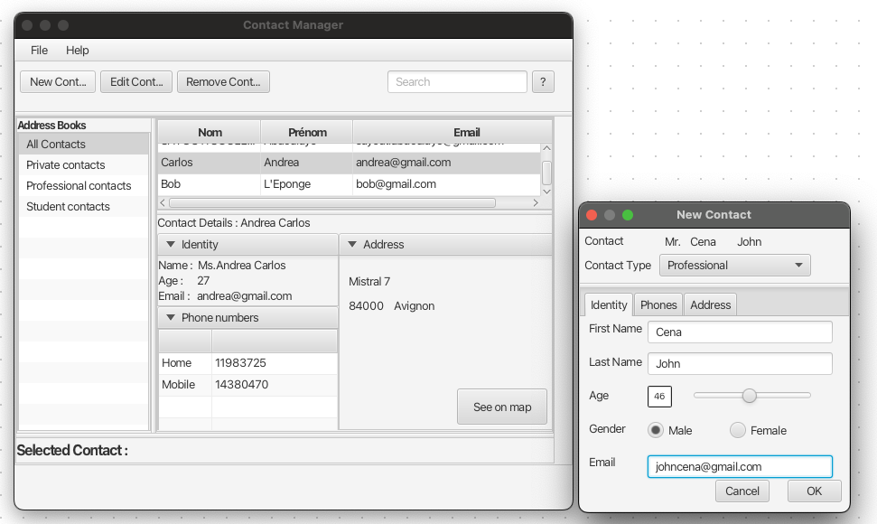

# Address-book-with-JavaFx
Address book with JavaFx and FXML

## Running the Application
To run the TSP Visualization App, follow these steps:

1. Ensure you have JavaFX installed. You can refer to the [official JavaFX documentation](https://openjfx.io/openjfx-docs/install-javafx) for installation instructions.

2. Navigate to the "dist" folder that contains the .jar file.

3. Execute the following command:
   
`java --module-path PATH-TO-FX --add-modules javafx.controls,javafx.fxml -jar TP1-Prototypage.jar`

Replace `PATH-TO-FX` with the path to your JavaFX SDK.

## License
This project is licensed under the [MIT License](LICENSE).

Feel free to contribute or report issues if you find any!
